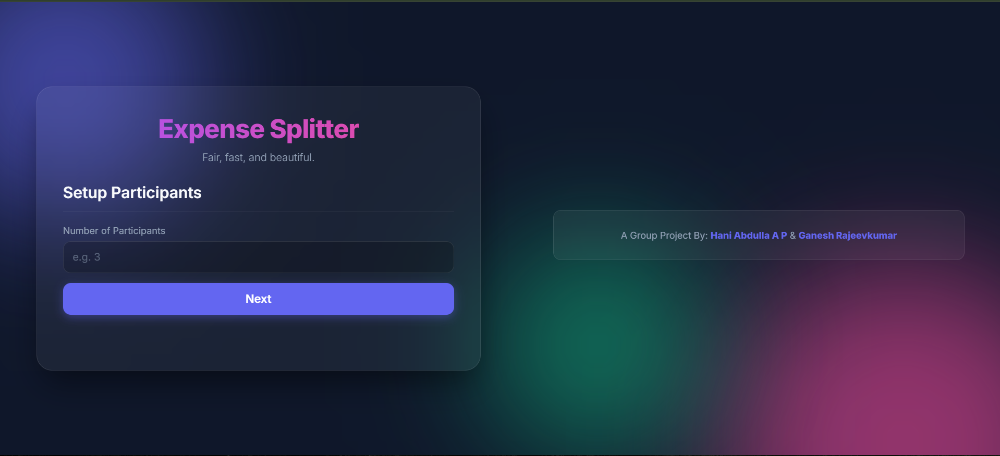

<h1 align='center'><b>💸 EXPENSE SPLITTER 💸</b></h1>

<h3 align='center'>Modern Expense Management</h3>

   
  
  

---

  

 

## ✨ Description 

This advanced expense splitter website allows users to input the number of participants, dynamically add their names, and record expenses with details on who paid. It calculates how much each participant owes or is owed. The UI has been completely overhauled with a modern, premium **glassmorphism** design, featuring smooth animations and a dynamic dark gradient background.

---

## 🚀 How to run it

1. Clone or download this repository.
2. Open the project folder.
3. Open `index.html` in any web browser.
4. Enjoy the seamless expense splitting experience!

---

## 👥 Team Members

This application is proudly developed as a group project by:
- **Hani Abdulla A P**
- **Ganesh Rajeevkumar**

---

<h3 align="center">Show some &nbsp;❤&nbsp; by &nbsp;🌟&nbsp; this repository!</h3>
